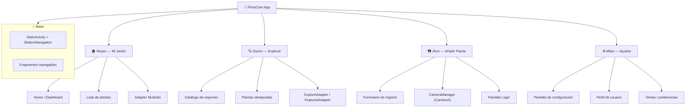

# 🌱 FloraCare

**Tu asistente inteligente para el cuidado de plantas.**  
FloraCare es una aplicación Android nativa que te ayuda a gestionar tu jardín personal, descubrir nuevas especies, registrar plantas con fotos y personalizar tu experiencia de cuidado.

---

## 📋 Índice

- [Stack Tecnológico](#-stack-tecnológico)
- [Organigrama de Trabajo](#-organigrama-de-trabajo)
- [Estructura del Proyecto](#-estructura-del-proyecto)
- [Instalación Rápida](#-instalación-rápida)
- [Contribuyentes](#-contribuyentes)

---

## 🛠 Stack Tecnológico

| Tecnología | Versión | Propósito |
|---|---|---|
|  | 1.9+ | Lenguaje principal |
|  | API 28–36 (Android 9–16) | SDK objetivo |
|  | 8.x + Kotlin DSL | Sistema de build |
|  | Core KTX 1.18.0 | Librerías base |
|  | 1.13.0 | UI components |
| **ViewBinding** | — | Binding seguro de vistas |
| **Navigation Component** | — | Navegación entre fragments |
| **CameraX** | — | Captura de fotos de plantas |
|  | 4.16.0 | Carga de imágenes |

---

## 🧑‍💻 Organigrama de Trabajo



---

## 📁 Estructura del Proyecto

```
app/src/main/java/com/uce/floracare/
├── MainActivity.kt                          # Actividad principal con Bottom Navigation
├── activities/
│   └── AuxiliarFragment.kt                  # Fragmento auxiliar
│
├── Jhon_AddPlant/                           # 👤 Jhon
│   ├── AddPlantFragment.kt                  #   Formulario para añadir planta
│   ├── CameraManager.kt                     #   Gestión de cámara con CameraX
│   └── Login.kt                             #   Pantalla de inicio de sesión
│
├── Milan_Ajustes/                           # 👤 Milan
│   └── AjustesFragment.kt                   #   Configuración y perfil
│
├── Osorio_Explore/                          # 👤 Osorio
│   ├── ExploreFragment.kt                   #   Pantalla de exploración
│   ├── ExploreAdapter.kt                    #   Adaptador del catálogo
│   ├── FeaturedAdapter.kt                   #   Adaptador de destacados
│   └── Plant.kt                             #   Modelo de datos
│
└── Reyes_MiJardin/                          # 👤 Reyes
    ├── MiJardinFragment.kt                  #   Vista "Mi Jardín"
    ├── Plant.kt                             #   Modelo de planta
    └── PlantAdapter.kt                      #   Adaptador de lista de plantas
```

### Layouts principales

```
app/src/main/res/layout/
├── activity_main.xml                        # Contenedor principal con BottomNavigation
├── activity_login.xml                       # Login
├── activity_mi_jardin.xml
├── fragment_add_plant.xml
├── fragment_ajustes.xml
├── fragment_auxiliar.xml
├── fragment_explore.xml
├── item_catalog_plant.xml                   # Card del catálogo
├── item_featured_plant.xml                  # Card de destacados
└── item_plant_card.xml                      # Card de planta en Mi Jardín
```

---

## ⚡ Instalación Rápida

### Requisitos previos

- **Android Studio** Hedgehog (2023.1.1) o superior
- **JDK** 17+
- Dispositivo o emulador con **API 28** mínimo

### Pasos

```bash
# 1. Clonar el repositorio
git clone https://github.com/tu-usuario/FloraCare.git

# 2. Abrir el proyecto en Android Studio
#    (File → Open → seleccionar la carpeta FloraCare)

# 3. Sincronizar Gradle
#    (esperar a que Android Studio descargue las dependencias)

# 4. Ejecutar
#    ▶ Run (Shift+F10) sobre el módulo :app
```

> 💡 **Tip:** Si encuentras errores de versión, revisa `gradle/libs.versions.toml` y ajusta las versiones según tu entorno.

---

## 👥 Contribuyentes

| Miembro | Rol | Módulo |
|---|---|---|
| **Reyes** | 🏠 Mi Jardín | Home, lista de plantas, adapters |
| **Osorio** | 🔍 Explorar | Catálogo, destacados, modelo de datos |
| **Jhon** | 📷 Añadir Planta | Formulario, cámara (CameraX), login |
| **Milan** | ⚙️ Ajustes | Configuración, perfil de usuario |

---

> 📌 **FloraCare** — Proyecto académico · Universidad Central del Ecuador · 8vo Semestre · Dispositivos Móviles
